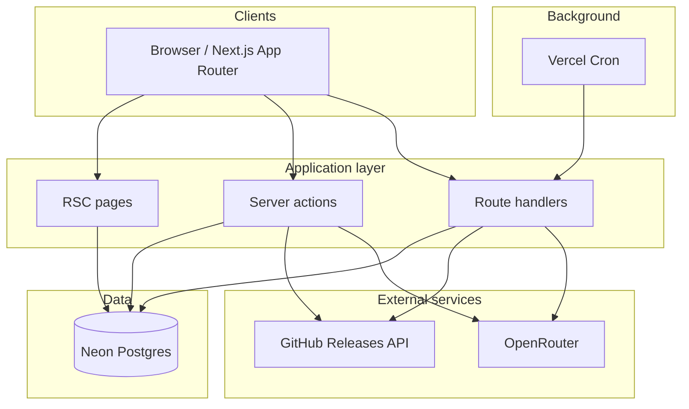

# System design

**Status:** current  
**Last verified:** 2026-05-31 (code + config in repo)

StackPulse architecture and **UI design system**. Read this before adding pages, components, or visual changes so new work matches the terminal-inspired product shell.

Related: [AGENT_START_HERE.md](./AGENT_START_HERE.md) (stack truth), [features/overview.md](./features/overview.md) (routes).

---

## Product architecture

StackPulse watches GitHub releases for user-selected stacks, AI-summarises them, and surfaces them in a filterable feed with optional upgrade Q&A.



### Core flows

| Flow | Entry | Writes | Reads |
|------|-------|--------|-------|
| Ingestion | Cron or `addCustomTech` | `release_updates`, `release_fetch_runs` | GitHub API → OpenRouter |
| Feed | `/dashboard`, `/api/releases` | — | `release_updates` + read state |
| Advice | `/api/release-advice` | — | Release rows + OpenRouter |
| Onboarding | `/onboarding` + `saveTechPreferences` | `user_tech_preferences` | `technologies` |
| Digest capture | `subscribeToDigest` | `digest_subscribers` | — (no sender) |

### Layering conventions

| Layer | Location | Responsibility |
|-------|----------|----------------|
| Routes | `src/app/**` | Layout, metadata, SSR data fetch, thin composition |
| Feature UI | `src/components/**` | Interactive UI; `'use client'` when needed |
| Server logic | `src/lib/**` | Auth, AI, GitHub, feed queries, actions |
| Data | `src/db/schema.ts` | Drizzle schema; migrations in `drizzle/` |
| Types | `src/lib/*-types.ts` | Shared filters, DTOs, parsers |

**Patterns to follow:**

- **RSC first** — fetch initial feed/options on the server; hydrate client with `initialPage` / `initialData` (see `dashboard/page.tsx` + `ReleaseFeed`).
- **Server actions** for mutations (`src/lib/actions.ts`); return `{ ok: true } | { ok: false; error: string }`.
- **Route handlers** for cron, paginated JSON, and AI endpoints.
- **URL state** via `nuqs` for feed filters; keep server parsers in `release-feed-types.ts` in sync with client.
- **Singleton lazy clients** — `getDb()`, `getAuth()`, OpenAI client in `ai.ts`.

---

## UI design system

### Visual identity

**Terminal / dev-workspace aesthetic** — not a generic SaaS dashboard.

- Dark void background with dotted grid + subtle noise (`globals.css` `body::before/after`)
- Monospace voice for headings, labels, CLI copy, errors
- “Window chrome” panels: traffic-light dots, title bars, faux shell paths (`~/dashboard/feed`)
- Syntax-inspired accents on semantic meaning (lime = primary action, rose = danger/breaking)
- Lowercase headings with a **lime full stop** after the title: `your feed<span class="text-lime">.</span>`

**Do not introduce:**

- Light mode (single dark theme only)
- Linear gradient backgrounds (project rule)
- Generic purple-on-white AI landing patterns
- Raw hex colors in components — use design tokens below

### Color tokens

Defined in `src/app/globals.css` `@theme` and `:root`. Use Tailwind classes, not hardcoded hex in JSX (except fixed traffic-light dot colors in `win-dots`).

| Token | Tailwind | Role |
|-------|----------|------|
| `--void` | `bg-void`, `text-void` | Page background, text on lime buttons |
| `--shade` | `bg-shade` | Panel/input background |
| `--lift` | `bg-lift` | Hover surfaces |
| `--panel` | `bg-panel` | Elevated panels |
| `--ink` | `text-ink` | Primary text |
| `--dust` | `text-dust` | Body secondary |
| `--fade` | `text-fade` | Labels, hints |
| `--mute` | `text-mute` | De-emphasised chrome |
| `--line` | `border-line` | Default borders |
| `--ruling` | `border-ruling` | Secondary borders |
| `--edge` | `border-edge` | Hover border emphasis |
| `--lime` | `text-lime`, `bg-lime` | Primary CTA, focus ring, selection |
| `--rose` | `text-rose` | Errors, breaking, destructive |
| `--amber` | `text-amber` | High importance, deprecation |
| `--cyan` | `text-cyan` | Medium importance, migration |
| `--emerald` | `text-emerald` | Features, success |
| `--violet`, `--magenta` | sparingly | Accent only |

shadcn semantic aliases (`primary`, `destructive`, `border`, etc.) map to the same palette — prefer **named tokens** (`text-dust`, `border-line`) in product UI for consistency with existing pages.

### Semantic badges (keep in sync)

Use the same class patterns everywhere (feed, public stacks, hero):

```txt
breaking / security  → border-rose/30 bg-rose/10 text-rose
deprecation          → border-amber/30 bg-amber/10 text-amber
migration            → border-cyan/30 bg-cyan/10 text-cyan
feature              → border-emerald/30 bg-emerald/10 text-emerald
importance critical  → rose tones
importance high      → amber
importance medium    → cyan
importance low        → border-fade/20 bg-dust/10 text-fade
```

Reference: `release-feed.tsx`, `stacks/[slug]/page.tsx`.

### Typography

| Use | Font | Classes |
|-----|------|---------|
| Body | Geist Sans | default `body`; prose `text-[14px]`–`text-[15px] leading-relaxed text-dust` |
| Headings, CLI, labels | Geist Mono | `font-mono`, often `lowercase`, `tracking-tight` |
| Page title | Mono | `text-3xl sm:text-[40px] font-bold text-ink` + lime `.` |
| Section kicker | Mono | `text-[11px] text-fade tracking-[0.2em] uppercase` with `§` in `text-lime` |
| Shell paths | Mono | `text-[11px]` breadcrumb: `~/` `dashboard` `/` `feed` |
| Form inputs | Mono | global rule in `globals.css` |

Fonts loaded in `src/app/layout.tsx` (`Geist`, `Geist_Mono`).

### Layout patterns

| Pattern | Usage |
|---------|--------|
| **Sticky header** | `sticky top-0 z-30 border-b border-line bg-void/80 backdrop-blur`, height `h-14`, `max-w-7xl px-6` |
| **Content width** | Landing/stacks: `max-w-7xl`; dashboard feed: `max-w-4xl`; legal: `max-w-3xl`; auth/errors: `max-w-md`–`max-w-lg` |
| **Page intro block** | Kicker → `h1` → `p` with `animate-fade-up` |
| **Frame panel** | `.frame` + optional `.frame-titlebar` + `win-dots` — cards, auth, errors, empty states |
| **Primary button** | `rounded-md bg-lime px-4 py-2.5 font-mono font-semibold text-void hover:bg-lime/85` with optional `$` prefix |
| **Secondary button** | `border border-ruling bg-shade … hover:border-edge hover:bg-lift` |
| **Destructive** | `bg-rose text-void` or rose text on rose/5 hover bg |

Reuse `<Logo />` in headers; link home with `hover:opacity-80 transition-opacity`.

### Icons

- **Product UI:** `hugeicons-react` (consistent across dashboard, landing, auth)
- **shadcn primitives:** `components.json` lists lucide for generated UI — do not mix lucide into feature pages unless adding shadcn components that require it

### Motion

| Tool | When |
|------|------|
| `animate-fade-up`, `animate-fade-in`, `stagger-*` | Page enter, lists |
| `motion/react` | Landing hero only (`stack-pulse-hero.tsx`) — avoid sprinkling motion elsewhere |
| `PulseLoader` | Loading states (not spinners) |
| `.skeleton` | Placeholders — pulse, not shimmer gradient |

Respect `prefers-reduced-motion` (already in `globals.css`).

### Shared components

| Component | Path | Use |
|-----------|------|-----|
| `Logo` | `components/logo.tsx` | Brand mark + wordmark |
| `ErrorView` | `components/ui/error-view.tsx` | Route error boundaries |
| `PulseLoader` | `components/ui/pulse-loader.tsx` | Inline/sm/lg loading |
| `Button` | `components/ui/button.tsx` | shadcn/base-ui when variant system helps |
| `LegalShell` | `components/landing/legal-shell.tsx` | Privacy/terms layout |
| `DigestSignupForm` | `components/landing/digest-signup-form.tsx` | Email capture block |

New surfaces should compose these before inventing parallel patterns.

### Copy voice

- **Lowercase** for UI chrome: `sign in`, `your feed`, `configure stack`
- **CLI metaphor:** `$ command`, `// comments`, `cd ..`, `exit code 1`, `→ hints`
- **Errors:** plain language, monospace, rose for fault — no corporate alert boxes
- **Avoid title case** in headings and buttons unless proper nouns (GitHub, StackPulse)

### Page templates

When adding a page, pick the closest template:

1. **Marketing / landing** — `page.tsx`: hero section, `StackPulseHero`, frame blocks, footer with mono links
2. **App shell** — sticky header + kicker/title + main (`dashboard`, `onboarding`)
3. **Public content** — stacks layout: header, stats, release cards with signal badges
4. **Auth / empty / error** — centered `frame` with titlebar + terminal copy
5. **Legal** — `LegalShell` + `legal-prose` class

---

## Data model (summary)

See [operations/database.md](./operations/database.md) for detail.

```
users ─┬─ user_tech_preferences ─ technologies ─ release_updates
       ├─ user_read_releases ────────┘
       └─ accounts / sessions (Better Auth)

digest_subscribers (standalone)
release_fetch_runs (audit)
```

---

## Security & boundaries

| Concern | Approach |
|---------|----------|
| Auth | Session via Better Auth; `requireUserId()` in actions |
| Cron | Bearer `CRON_SECRET`, timing-safe compare |
| Rate limits | In-memory maps for digest signup + AI advice (per IP / user) |
| AI prompts | Untrusted release body treated as data; Zod-validated outputs |
| Dashboard SEO | `robots: noindex` on `(dashboard)` layout |

---

## Extension checklist

Before shipping UI or architecture changes:

- [ ] Uses design tokens (`text-dust`, `border-line`, `bg-lime`) — no ad-hoc hex
- [ ] Headings follow mono + lowercase + lime `.` pattern where appropriate
- [ ] Panels use `frame` / sticky header patterns from sibling pages
- [ ] Badges match semantic tone table above
- [ ] Icons from `hugeicons-react` in product surfaces
- [ ] Loading uses `PulseLoader` or `.skeleton`
- [ ] Server/client split matches existing RSC + action/handler pattern
- [ ] Update [AGENT_START_HERE.md](./AGENT_START_HERE.md) if routes, env, or stack truth changes
